# Realtime Chat App Plus - System Architecture

## Overview
This system is a microservices-based realtime chat application, designed for scalability, security, and cloud-native deployment (GKE Autopilot). It includes authentication, chat, media AI, and a React client, all orchestrated via Kubernetes.

---

## Visual Architecture & Workflow

```mermaid
flowchart TD
    subgraph Client
        A1[client/src/main.jsx]
        A2[client/Dockerfile]
        A3[client/public/index.html]
        A4[client/src/pages/ChatPage/]
        A5[client/src/context/SocketContext.jsx]
    end

    subgraph API_Gateway
        B1[services/api-gateway/index.js]
        B2[services/api-gateway/routes/]
        B3[services/api-gateway/Dockerfile]
    end

    subgraph Auth_Service
        C1[services/auth-user-service/index.js]
        C2[services/auth-user-service/controllers/AuthController.js]
        C3[services/auth-user-service/routes/AuthRoutes.js]
        C4[services/auth-user-service/Dockerfile]
    end

    subgraph Chat_Service
        D1[services/chat-service/index.js]
        D2[services/chat-service/socket.js]
        D3[services/chat-service/helpers/aiAssistant.js]
        D4[services/chat-service/models/MessageModel.js]
        D5[services/chat-service/Dockerfile]
    end

    subgraph Media_AI_Service
        E1[services/media-ai-service/index.js]
        E2[services/media-ai-service/helpers/aiAssistant.js]
        E3[services/media-ai-service/Dockerfile]
    end

    subgraph Database
        F1[mongo.yaml]
        F2[redis.yaml]
    end

    subgraph Kubernetes
        G1[cloud/k8s/base/api-gateway.yaml]
        G2[cloud/k8s/base/auth-user-service.yaml]
        G3[cloud/k8s/base/chat-service.yaml]
        G4[cloud/k8s/base/media-ai-service.yaml]
        G5[cloud/k8s/base/client.yaml]
        G6[cloud/k8s/base/configmap.yaml]
        G7[cloud/k8s/base/secret.yaml]
        G8[cloud/k8s/overlays/gke/kustomization.yaml]
    end

    subgraph CI_CD
        H1[.github/workflows/ci.yaml]
        H2[deploy-cloud.txt]
    end

    %% Workflow
    A1 -->|REST/WebSocket| B1
    B1 -->|Auth| C1
    B1 -->|Chat| D1
    B1 -->|Media AI| E1
    C1 -->|DB| F1
    D1 -->|DB| F1
    D1 -->|Cache| F2
    E1 -->|DB| F1
    B1 -->|Config/Secrets| G6
    C1 -->|Config/Secrets| G6
    D1 -->|Config/Secrets| G6
    E1 -->|Config/Secrets| G6
    G1 -->|Deploy| B1
    G2 -->|Deploy| C1
    G3 -->|Deploy| D1
    G4 -->|Deploy| E1
    G5 -->|Deploy| A1
    H1 -->|Build/Push/Deploy| G8
    H2 -->|Manual Deploy| G8
```



---

## Directory & File Structure

- `client/` - React frontend
  - `src/` - Components, pages, context, assets
  - `Dockerfile` - Nginx build for cloud
  - `vite.config.js` - Vite config
- `services/`
  - `api-gateway/` - API Gateway
    - `index.js` - Entrypoint
    - `routes/` - API routes
    - `Dockerfile` - Build config
  - `auth-user-service/` - Auth microservice
    - `index.js` - Entrypoint
    - `controllers/` - Auth logic
    - `routes/` - Auth routes
    - `Dockerfile` - Build config
  - `chat-service/` - Chat microservice
    - `index.js` - Entrypoint
    - `helpers/aiAssistant.js` - AI chatbot logic
    - `socket.js` - Socket.io logic
    - `Dockerfile` - Build config
  - `media-ai-service/` - AI microservice
    - `index.js` - Entrypoint
    - `helpers/aiAssistant.js` - Gemini/OpenAI logic
    - `Dockerfile` - Build config
  - `shared/` - Shared code (auth, cors)
- `server/` - Legacy monolith (migrated to microservices)
- `cloud/k8s/base/` - Kubernetes base manifests
  - `api-gateway.yaml` - API Gateway deployment/service
  - `auth-user-service.yaml` - Auth service deployment/service
  - `chat-service.yaml` - Chat service deployment/service
  - `media-ai-service.yaml` - Media AI deployment/service
  - `client.yaml` - Frontend deployment/service
  - `mongo.yaml` - MongoDB deployment/service
  - `redis.yaml` - Redis deployment/service
  - `configmap.yaml` - Shared config/envs
  - `secret.yaml` - Shared secrets
- `cloud/k8s/overlays/gke/` - Kustomize overlays for GKE
  - `patch-images.yaml` - Artifact Registry images
  - `patch-services.yaml` - LoadBalancer/static IP
  - `patch-resources.yaml` - Resource limits
  - `kustomization.yaml` - Overlay config
- `.github/workflows/ci.yaml` - CI/CD pipeline (build, push, deploy)
- `deploy-cloud.txt` - Step-by-step cloud deployment script

---

## Service Logic & Flow

### 1. Client (React/Nginx)
- UI/UX for chat, auth, photo feed, profile
- Connects to API Gateway via REST/WebSocket
- Uses `VITE_SERVER_URL` from configmap for API endpoint

### 2. API Gateway
- Centralizes all API traffic
- Forwards requests to auth, chat, media services
- Handles CORS, rate limiting, logging
- Defined in `services/api-gateway/index.js`, routes in `routes/`

### 3. Auth Service
- Handles signup/login (email, OAuth)
- Manages JWT/session, password hashing
- OAuth callback URLs set via secret/configmap
- Controllers in `controllers/`, routes in `routes/`

### 4. Chat Service
- Manages chat rooms, messages, groups
- Real-time via Socket.io (`socket.js`)
- AI chatbot logic in `helpers/aiAssistant.js` (calls Gemini API)
- MongoDB for message storage

### 5. Media AI Service
- Handles AI features (image, audio, Gemini/OpenAI)
- AI logic in `helpers/aiAssistant.js`
- Connects to cloud APIs using keys from secret/configmap

### 6. MongoDB & Redis
- MongoDB: User, message, photo, group data
- Redis: Session, cache, rate limiting
- Both deployed via `mongo.yaml` and `redis.yaml`

---

## Kubernetes & Cloud Deployment

- All services defined in `cloud/k8s/base/*.yaml`
- Config/envs in `configmap.yaml`, secrets in `secret.yaml`
- Static IPs for API Gateway/client set in service YAMLs and Google Cloud
- Kustomize overlays for GKE in `cloud/k8s/overlays/gke/`
- CI/CD pipeline in `.github/workflows/ci.yaml` automates build/push/deploy
- Deployment steps in `deploy-cloud.txt`

---

## Security & Best Practices

- Secrets never committed to git; managed via Kubernetes secrets
- OAuth callback URLs use static IP/domain for cloud
- JWT/session for auth, bcrypt+pepper for passwords
- Resource limits set for all pods
- CORS and allowed origins managed in configmap

---

## Troubleshooting
- Pod logs: `kubectl logs deploy/<service>`
- Env check: `kubectl exec <pod> -- printenv`
- Rollout restart: `kubectl rollout restart deploy/<service>`
- API key issues: Update secret/configmap, restart pods

---

## References
- See each service's `Dockerfile` for build logic
- See `helpers/aiAssistant.js` in chat-service/media-ai-service for AI logic
- See `cloud/k8s/base/*.yaml` for deployment details
- See `.github/workflows/ci.yaml` for CI/CD automation
- See `deploy-cloud.txt` for full cloud deployment steps
- 


# Microservice Architecture Diagram

```mermaid
flowchart TD
    subgraph Client
        A1[React App (Nginx)]
    end

    subgraph API_Gateway
        B1[API Gateway]
    end

    subgraph Auth_Service
        C1[Auth Service]
    end

    subgraph Chat_Service
        D1[Chat Service]
    end

    subgraph Media_AI_Service
        E1[Media AI Service]
    end

    subgraph Database
        F1[MongoDB]
        F2[Redis]
    end

    subgraph External
        G1[Cloudinary]
        G2[Livekit]
        G3[OIDC Provider (Keycloak/Google/Azure)]
    end

    %% Workflow
    A1 -- REST/WebSocket --> B1
    B1 -- Auth --> C1
    B1 -- Chat --> D1
    B1 -- Media AI --> E1
    C1 -- DB --> F1
    D1 -- DB --> F1
    D1 -- Cache --> F2
    E1 -- DB --> F1
    E1 -- Cloud AI --> G1
    D1 -- Livekit --> G2
    C1 -- OIDC --> G3
    B1 -- Config/Secrets --> F2
```

**Giải thích:**
- Client (React/Nginx) giao tiếp với API Gateway qua REST/WebSocket.
- API Gateway phân phối request tới các microservice: Auth, Chat, Media AI.
- Auth Service xác thực, có thể kết nối OIDC/SSO.
- Chat Service xử lý chat realtime, lưu dữ liệu vào MongoDB, cache bằng Redis, gọi Livekit cho video/audio.
- Media AI Service xử lý AI, lưu dữ liệu vào MongoDB, kết nối Cloudinary cho media.
- Database gồm MongoDB (dữ liệu chính) và Redis (cache/session).
- External gồm Cloudinary (media), Livekit (call), OIDC Provider (SSO).

Sơ đồ này tập trung vào các thành phần chính, workflow và kết nối giữa các microservice.
